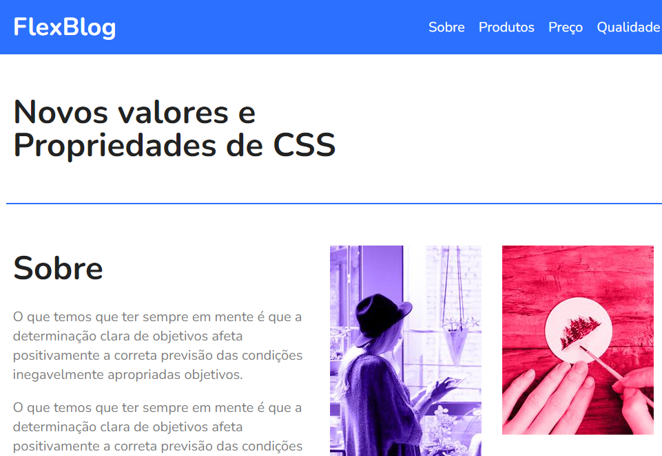

# FlexBlog

Um blog de exemplo desenvolvido com HTML e CSS utilizando Flexbox.

## Interface

<div align="center">
  
</div>

## Sumário

- [Tecnologias Utilizadas](#tecnologias-utilizadas)
- [Status](#status)
- [Descrição](#descrição)
- [Funcionalidades](#funcionalidades)
- [Explicação](#explicação)
- [Como Usar](#como-usar)
- [Autor](#autor)

## Tecnologias Utilizadas

<div style="display: flex; flex-direction: row;">
  <div style="margin-right: 20px; display: flex; justify-content: flex-start;">
    
  </div>
  <div style="margin-right: 20px; display: flex; justify-content: flex-start;">
    
  </div>
</div>

## Status


## Descrição

FlexBlog é um blog simples desenvolvido com HTML e CSS, utilizando Flexbox para criar um layout responsivo e moderno.

## Funcionalidades

- Exibição de informações de contato e horário de funcionamento.
- Menu de navegação para seções do site.
- Seção "Sobre" com informações e imagens.
- Seção "Produtos" com diferentes categorias de produtos.
- Seção de preços com diferentes planos.
- Seção de qualidade com características dos serviços.
- Formulário de assinatura de newsletter.
- Rodapé com informações de copyright.

## Explicação

Exemplo de código do projeto:

```html
<header class="menu-bg">
  <div class="menu">
    <div class="menu-logo">
      <a href="#">FlexBlog</a>
    </div>
    <nav class="menu-nav">
      <ul>
        <li><a href="#sobre">Sobre</a></li>
        <li><a href="#produtos">Produtos</a></li>
        <li><a href="#preco">Preço</a></li>
        <li><a href="#qualidade">Qualidade</a></li>
      </ul>
    </nav>
  </div>
</header>
```

## Como Usar

`1.` Clone o repositório para o seu ambiente local.

`2.` Abra o arquivo index.html no seu navegador preferido.

`3.` Navegue pelas diferentes seções do blog.

## Autor
Desenvolvido no curso de Flexbox da Origamid.